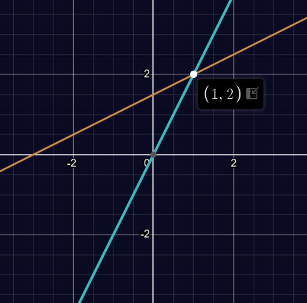

# 01 - Geometry of Linear Equations

## The Fundamental Problem of Linear Algebra
The central problem in linear algebra is solving systems of linear equations.
This lecture focuses on systems with an equal number of equations and unknowns
($n$ equations, $n$ unknowns).

### Three Ways to Visualize Linear Systems
1.  **Row Picture**: Viewing one equation at a time
2.  **Column Picture***: Viewing the problem in terms of columns (especially important)
3.  **Matrix Form**: Using matrix notation to represent the system

## Example 2 $\times$ 2 System
Consider the system:
$$
2x - y = 0 \\
-x + 2y = 3
$$

### Matrix Form
The system can be written in matrix form as $Ax=b$ where:
$$
A = \left[\begin{matrix} 2 & -1 \\ -1 & 2 \end{matrix}\right],\hspace{0.2cm}
x = \left[\begin{matrix} x \\ y \end{matrix}\right],\hspace{0.2cm}
b = \left[\begin{matrix} 0 \\ 3 \end{matrix}\right]
$$

### Row Picture

